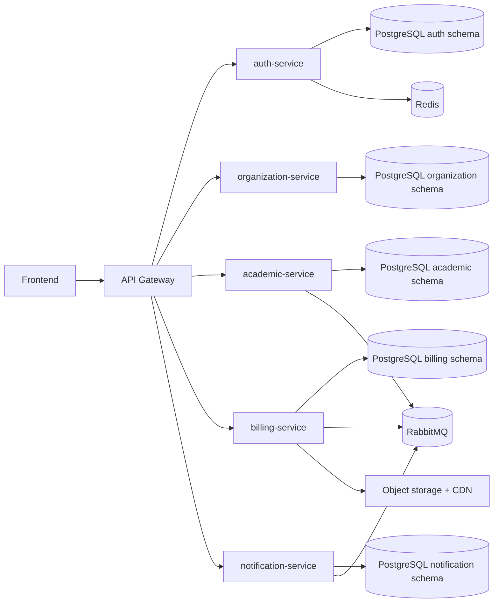
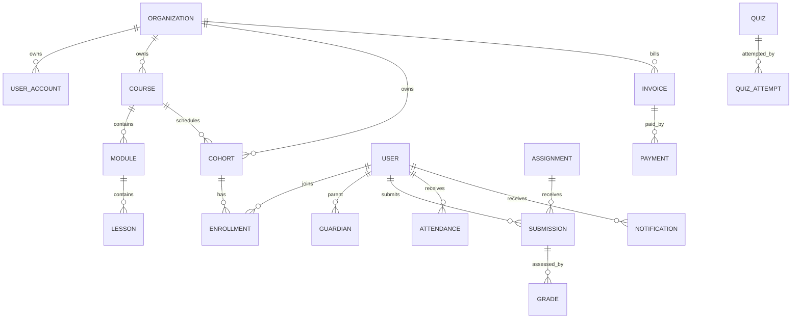

# Architecture And Domain Diagrams

## Runtime Architecture

## ERD / Domain Ownership

Ownership boundaries:

- `auth-service`: identity, sessions, refresh rotation, audit events.
- `organization-service`: tenant lifecycle, branding, settings, domain verification.
- `academic-service`: courses, cohorts, schedules, assignments, quizzes, grades, attendance, certificates, student documents.
- `billing-service`: subscriptions, invoices, payments, checkout/webhook idempotency.
- `notification-service`: delivery queue, preferences, templates, read/delete state.
