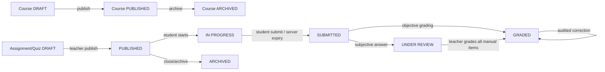

# LMS MVP product requirement and permission contract

Status: **Approved baseline**  
Version: 1.0 — 2026-08-03  
Owner: Product + Engineering  

This document is the release contract for the first production MVP. A feature is not part of the MVP unless it is listed as in scope below. UI visibility never grants authority; every permission must also be enforced by the authoritative service using the authenticated user and `organizationId`.

## 1. Product scope

### In scope

- Tenant onboarding and organization settings; invitation, activation, suspension and role assignment.
- Academic structure: academic years, terms, departments, programs and classes/cohorts.
- Course, module, lesson and secure learning-resource management.
- Enrollment and cohort membership.
- Schedules in the `Asia/Ulaanbaatar` timezone.
- Assignments, student submissions, attachments, grading and feedback.
- Secure quizzes: immutable attempts, server scoring, expiry, attempt limits and manual review.
- Attendance and student gradebook.
- Announcements and in-app/email notification delivery.
- Approved guardian-to-student linking and guardian read-only progress visibility.
- Audit, privacy requests, retention controls and basic operational health.

### Explicitly out of scope

- Billing, subscriptions, invoices, payment collection/refunds and finance reports. The `FINANCE` enum remains reserved for data compatibility, but has profile-only access in MVP.
- Native mobile applications; offline-first course consumption; live video classroom.
- AI content generation or automated grading of subjective answers.
- SCORM/LTI, third-party SIS synchronization and public marketplace integrations.
- Advanced BI/data warehouse, custom report builder, custom tenant roles and per-field ACLs.
- Multi-region active-active availability and contractual 24/7 support.

Scope changes require an updated version of this contract, security review, acceptance criteria and release approval.

## 2. Capability matrix

Legend: `O` own/linked resources only, `A` assigned course/cohort only, `T` current tenant, `G` global/cross-tenant, `—` denied. Export is always audited and must apply the same row scope as read.

| Capability | Student | Teacher | Parent | Staff | Principal | Org admin | Super admin | Finance |
|---|---|---|---|---|---|---|---|---|
| Profile/security | O | O | O | O | O | O | O | O |
| Users and role assignment | — | — | — | — | T read | T CRUD | G CRUD | — |
| Academic structure | T read | T read | T read | T read | T read | T CRUD/publish | G support | — |
| Courses/content | enrolled read | A CRUD/publish | linked-child read | T read | T read | T CRUD/publish | G support | — |
| Cohorts/enrollments | O read | A read | linked-child read | T CRUD | T read | T CRUD | G support | — |
| Schedules | O read | A CRUD | linked-child read | T CRUD | T read/export | T CRUD/export | G support | — |
| Assignments/quizzes | O participate | A CRUD/publish/grade | linked-child results | T read | T read/export | T CRUD/publish/export | G support | — |
| Grades/attendance | O read | A CRUD | linked-child read | T attendance CRUD | T read/export | T CRUD/export | G support | — |
| Announcements | T read | A CRUD/publish | T read | T CRUD/publish | T publish | T CRUD/publish | G support | — |
| Guardian links | own link read | A read | O request/read | T review | T read | T CRUD | G support | — |
| Audit/system reports | — | own-action read | — | — | T read/export | T read/export | G read/export | — |
| Billing/finance | — | — | — | — | — | — | — | — |

`SUPER_ADMIN` access is break-glass operational support, not implicit ownership: cross-tenant reads/writes require an explicit target tenant, reason, audit event and short-lived elevated session.

## 3. Resource operation contract

| Resource | Create | Read | Update | Delete | Publish/finalize | Export |
|---|---|---|---|---|---|---|
| Organization | Super admin/onboarding | tenant members (safe fields) | org admin; super admin support | soft-delete: super admin | org admin activate | org admin/super admin |
| User | org admin | self; org admin; principal safe read | self safe fields; org admin role/status | soft-delete org admin | invite/activate org admin | org admin |
| Academic structure | org admin | tenant members | org admin | org admin if unused | org admin | principal/org admin |
| Course/module/lesson | assigned teacher, org admin | enrolled/linked/tenant oversight | owner teacher, org admin | owner teacher draft; org admin | owner teacher/org admin | principal/org admin |
| Cohort/enrollment | staff, org admin | scoped matrix above | staff, org admin | staff/org admin if policy permits | org admin | principal/org admin |
| Schedule | assigned teacher, staff, org admin | scoped matrix above | creator within scope, staff, org admin | same as update | staff/org admin | principal/org admin |
| Assignment/quiz/question | assigned teacher, org admin | enrolled students after publish; oversight roles | owner teacher/org admin | draft owner/org admin | owner teacher/org admin | principal/org admin |
| Submission/quiz attempt | student for self | self; assigned teacher/admin | self before deadline | no hard delete | student submit; server auto-submit | principal/org admin results |
| Grade/feedback | assigned teacher/org admin | scoped learner/guardian/oversight | assigned teacher/org admin | correction audit only | assigned teacher/org admin | principal/org admin |
| Attendance | assigned teacher/staff/org admin | scoped matrix above | assigned teacher/staff/org admin | correction audit only | n/a | principal/org admin |
| Announcement | teacher/staff/org admin | intended tenant audience | creator in scope/org admin | creator in scope/org admin | teacher/staff/org admin | org admin |
| Guardian link | parent request; staff/admin invite | linked parties and reviewers | staff/org admin approval | revoke by linked parent/staff/admin | staff/org admin approve | org admin |
| Audit/privacy record | system only | subject-safe privacy view; authorized oversight | append-only | retention job only | n/a | principal/org admin/super admin scoped |

Hard deletion is forbidden after a resource has dependent academic evidence. Archive, revoke or soft-delete must be used instead.

## 4. Ownership and authorization invariants

1. **Organization:** every tenant row carries authoritative `organizationId`. Client tenant headers and request bodies cannot select or override it. Cross-tenant joins are forbidden.
2. **Course instructor:** write access requires `course.instructorId == actor.userId` or an active co-instructor relation. Assignment to the same organization alone is insufficient.
3. **Cohort:** teacher access derives from an assigned course/cohort; staff/admin access is tenant-wide. Membership never grants management permission to a student.
4. **Enrollment:** an active enrollment grants the student read/participation access only during the applicable course lifecycle. Enrollment creation/removal belongs to staff/admin.
5. **Guardian:** access requires an approved, non-revoked guardian link to the exact student. It never grants write access to academic records or visibility into other students.
6. All child-resource lookups include organization plus parent ownership. Returning `404` for inaccessible resource identifiers is preferred where it prevents enumeration.

## 5. Academic workflow states

Only published content is visible to learners. Submitted evidence is immutable except through an audited grading/correction operation.

## 6. Role journeys and acceptance criteria

- **Student:** sign in → view enrolled courses/schedule → submit assignment or quiz → view permitted result. Accepted when only active enrollment data is visible, deadlines are server-enforced, answers cannot set scores, and hidden-result policy is honored.
- **Teacher:** sign in → manage assigned course content → publish work → review submissions/attendance → grade. Accepted when unassigned courses are neither discoverable nor writable and every publish/grade is attributable.
- **Parent:** link through approval → select linked child → view schedule, attendance and released progress. Accepted when pending/revoked links expose no child data and academic records are read-only.
- **Staff:** manage approved operational workflows, cohorts/enrollments, schedules and attendance. Accepted when access stays tenant-scoped and staff cannot assign privileged roles or alter grades outside granted endpoints.
- **Principal:** review tenant-wide academic performance, schedules and audit data → export scoped reports. Accepted when operational records are read-only and exports are audited.
- **Org admin:** configure tenant/academic structure → invite users and assign roles → oversee all tenant resources. Accepted when no other tenant is addressable and destructive lifecycle actions preserve dependent evidence.
- **Super admin:** enter an explicitly selected tenant support context → diagnose/repair authorized issue → leave context. Accepted when reason/elevation is audited and ordinary tenant content is not listed globally by default.
- **Finance:** MVP journey is sign in → profile/security only. Accepted when no billing navigation, finance dashboard, billing API route or billing OpenAPI operation is exposed.

## 7. MVP non-functional targets

These are launch SLO targets, not paid contractual guarantees.

| Area | MVP target |
|---|---|
| Availability | 99.5% monthly, excluding announced maintenance |
| Planned maintenance | up to 4 hours/month, announced 48 hours ahead |
| API latency | p95 ≤ 750 ms for normal reads/writes; p95 ≤ 2 s for reports |
| Incident response | P1 acknowledge ≤ 30 min, restore/workaround target ≤ 4 h during support hours |
| Support hours | 09:00–18:00 Asia/Ulaanbaatar, business days |
| Backup objectives | RPO ≤ 24 h, RTO ≤ 8 h; restore drill quarterly |
| Browsers | latest 2 stable Chrome, Edge, Firefox; current and previous Safari major |
| Devices | responsive web at ≥360 px; desktop ≥1280 px recommended for authoring/admin |
| Accessibility | keyboard-operable core journeys; WCAG 2.1 AA target |
| Tenant scale | 100 active tenants; 5,000 users/tenant; 1,000 concurrent sessions platform-wide |
| Academic data | 500 courses, 10,000 enrollments, 1M submissions/attempts per tenant retained per policy |
| Uploads | 25 MB/file default; executable files denied; tenant quota configured operationally |

Load tests must validate these volumes before general availability. Capacity above a stated target requires a sizing review rather than silent acceptance.

## 8. Billing feature gate

Billing is disabled by default with `FEATURE_BILLING_ENABLED=false`. In MVP:

- the gateway does not register `/api/payments` or `/api/invoices`;
- OpenAPI does not advertise billing operations;
- billing-service is behind the optional Compose `billing` profile and is not a gateway dependency;
- admin billing and finance placeholder routes/navigation are absent from the frontend build.

Enabling billing later requires its own PRD, provider/security review, tenant-isolation and webhook-idempotency tests, and `FEATURE_BILLING_ENABLED=true` plus the Compose `billing` profile.
